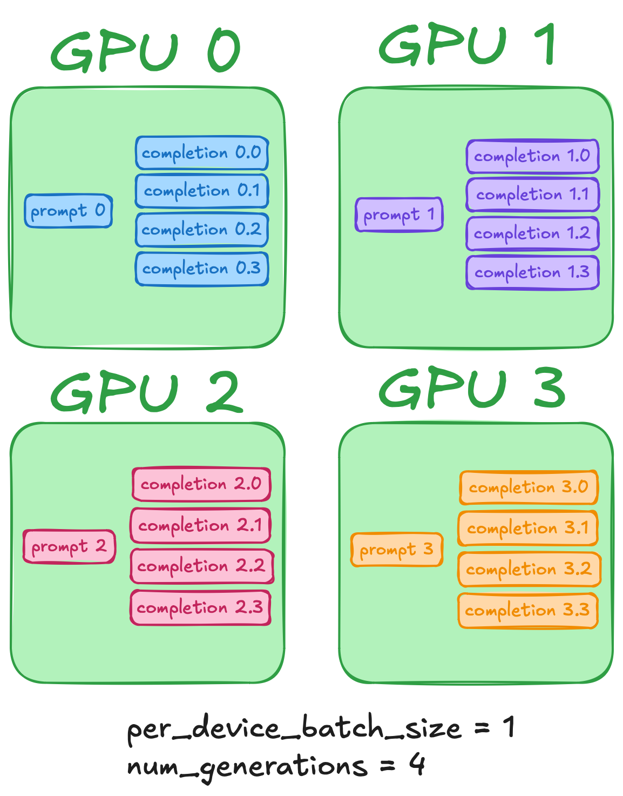
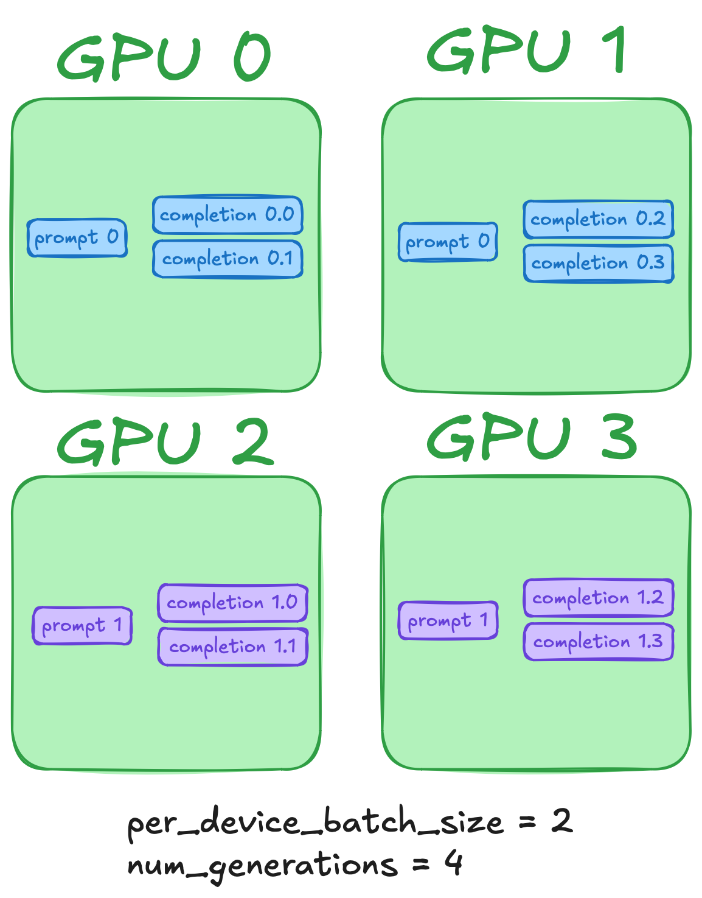

# MMR1

## ⚙️ **Environment**

- Follow the instruction in https://github.com/FanqingM/R1-Multimodal-Journey
- Update the transformers to the 4.49.0.dev0 to support the Qwen2.5_VL
- `pip install vllm == 0.7.2 trl == 0.15.0.dev0` to support vLLM

## 🚨 **Notes**

- You are supported to get the permission of `B:kanelin-jfs` and rlaunch your machine by `--mount=juicefs+s3://oss.i.shaipower.com/kanelin-jfs:/mnt/jfs-test` to access the dataset and the model.

## 📋 **ToDos**

- [x] Accelerate and support `vllm`
- [x] Fix the bug of gradient checkpointing
- [x] Support scale up rollout size
- [x] Support Multi-machine parallel
- [ ] Support `Kimi-KL`
- [ ] Support `OCR` Tasks
- [ ] Support `Detection` Tasks
- [ ] Remove all the absolute path

## 📅 **Update Logs**
### 2025.02.16
#### add some hyperparameters
you can view the ```src/open_r1/arguments.py``` for detail info of every hyperparameters and use the ```train_qwen22b_perpo.sh``` to train qwen baseline on perpo grounding task.

-use_kl: whether to use kl in loss. If false, no kl will be included into loss. But you can also view kl change trends in pandb.

-kl_approximator: which type kl to use for computing loss.you can use k1(not good), k3(official in grpo, unbias, lowest variance), 
kimikl(only the kl used in kimi1.5), kimifull(the same setting as the core idea of kimi1.5, 
your value of sync_ref_model, ref_model_mixup_alpha and ref_model_sync_steps will be invalid, they are all set the same as kimi1.5)

-entropy_reg: whether to use entropy regularization while training. For discriminative tasks like grounding, ocr and counting, we expect entropy to decrease.
For literary creation task, we expect entropy to increase. this can be controlled by entropy_weight.

-entropy_weight: the weight for entropy loss. It's only valid when entropy_reg is true. If it's positive, the entropy is to increase. If it's negetive, the entropy is to decrease.

-temperature_func: which temperature function to use while training. Unlike reward_funcs, you can only use one temperature function. The available function is "linear" and "const"

-order_dataset： which order to use.

### 2025.02.15
- xxx
``` python
```

## 🚀 **Quick Start**

You can run the following command to quickly start the training of `LLaVA-GRPO-Perpo`.

```bash
bash local_scripts/train/train_llava_perpo.sh
```

## 🥩 **Mini-Batch**
Optimize GRPO memory usage by redefining per_device_batch_size as generations per device, introduces a more flexible approach:

- Instead of defining per_device_batch_size as the number of prompts per device, it now represents the number of generations per device.
- This allows for much greater flexibility in choosing the number of generations (G) and the batch size per device.
- The only constraint is that the global batch size (num_processes * per_device_batch_size) must be divisible by G.

Note that these settings should be equivalent:

```python
num_generations = ...  # eg, 8
num_prompts_per_device = ...  # eg, 1
# main
GRPOConfig(num_generations=num_generations, per_device_batch_size=num_prompts_per_device, ...)
# this PR
GRPOConfig(num_generations=num_generations, per_device_batch_size=num_generations*num_prompts_per_device, ...)
```

<table align="center" cellpadding="0" cellspacing="0">
  <tr>
    <td align="center"><h3>Original Training</h3></td>
    <td align="center"><h3>Mini-Batch Training</h3></td>
  </tr>
  <tr>
    <td></td>
    <td></td>
  </tr>
</table>
